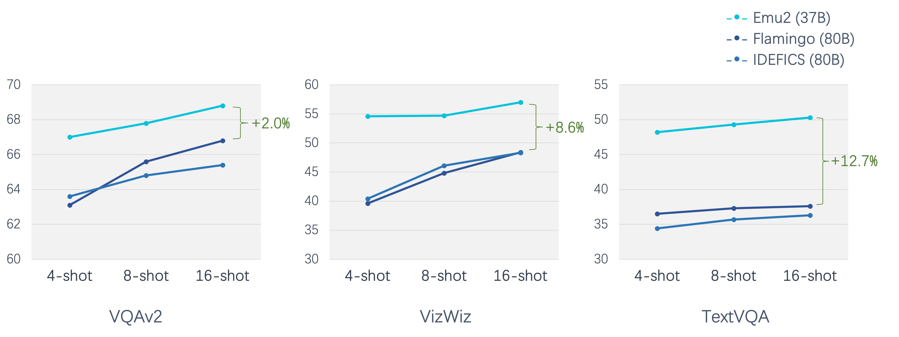
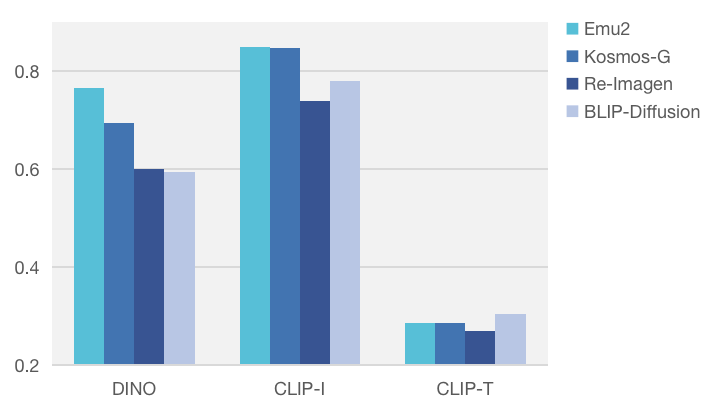

<div align='center'>
<h1>Generative Multimodal Models are In-Context Learners</h1h1>
<h3><a href="">Generative Multimodal Models are In-Context Learners</a></h3>

[Quan Sun](https://github.com/Quan-Sun)<sup>1*</sup>, [Yufeng Cui](https://scholar.google.com/citations?hl=en&user=5Ydha2EAAAAJ)<sup>1*</sup>, [Xiaosong Zhang](https://zhangxiaosong18.github.io)<sup>1*</sup>, [Fan Zhang](https://scholar.google.com/citations?user=VsJ39HMAAAAJ)<sup>1*</sup>, [Qiying Yu](https://yqy2001.github.io)<sup>2,1*</sup>, [Zhengxiong Luo](https://greatlog.github.io)<sup>1</sup>, [Yueze Wang]()<sup>1</sup>, [Yongming Rao](https://raoyongming.github.io)<sup>1</sup>,<br>[Jingjing Liu](https://air.tsinghua.edu.cn/en/info/1046/1194.htm)<sup>2</sup>, [Tiejun Huang](https://scholar.google.com/citations?user=knvEK4AAAAAJ&hl=en)<sup>1,3</sup>, [Xinlong Wang](https://www.xloong.wang/)<sup>1†</sup>

<sup>1</sup> [BAAI](https://www.baai.ac.cn/english.html), <sup>2</sup> [THU](https://air.tsinghua.edu.cn), <sup>3</sup> [PKU](https://english.pku.edu.cn/) <br><sup>*</sup> equal contribution   <sup>†</sup> project lead

|  [Paper](https://arxiv.org/abs/2312.13286) | [Fast Demo](https://emu.ssi.plus)  | [🤗HF Demo](https://huggingface.co/spaces/BAAI/Emu2) | [🤗HF Models](https://huggingface.co/BAAI/Emu2) | [Project Page](https://baaivision.github.io/emu2/) | [Video Demo](https://www.youtube.com/watch?v=nz4BJ7MKtKo&t=9s) |


</div>

We introduce **Emu2**, a generative multimodal model with 37 billion parameters, trained on large-scale multimodal sequences with a unified autoregressive objective.
**Emu2** exhibits strong multimodal in-context learning abilities, even emerging to solve tasks that require on-the-fly reasoning.
The model sets a new record on multiple multimodal understanding tasks in few-shot settings.
When instruction-tuned to follow specific instructions, **Emu2** further achieves new state-of-the-art on challenging tasks such as question answering benchmarks for large multimodal models and open-ended subject-driven generation.
These achievements demonstrate that **Emu2** can serve as a base model and general-purpose interface for a wide range of multimodal tasks. 


## Emu2 is a strong multimodal few-shot learner

<div align='center'>

</div>


## An impressive multimodal generalist

<div align='center'>

</div>


## A skilled painter

<div align='center'>
    
    
</div> 

<div align='center'>
Zero-shot subject-driven generation
</div> 


## Refer Expression Comprehension
We supplemented the results of Refer Expression Comprehension on RefCOCO, RefCOCO+, RefCOCOg, and compared them with generalist models.

| Model | RefCOCO<br>val | RefCOCO<br>testA | RefCOCO<br>testB | RefCOCO+<br>val | RefCOCO+<br>testA | RefCOCO+<br>testB | RefCOCOg<br>val | RefCOCOg<br>test |
| :-----------: | :-: | :-: | :-: | :-: | :-: | :-: | :-: | :-: |
| OFA-L         | 79.96 | 83.67 | 76.39 | 68.29 | 76.00 | 61.75 | 67.57 | 67.58 |
| Shikra-13B    | 87.83 | 91.11 | 81.81 | 82.89 | 87.79 | 74.41 | 82.64 | 83.16 |
| Qwen-VL-7B    | 89.36 | 92.26 | 85.34 | 83.12 | 88.25 | 77.21 | 85.58 | 85.48 |
| **Emu2-Chat** | **90.40** | **93.88** | **85.97** | **87.05** | **91.43** | **80.47** | **87.64** | **88.11** |


## Setup

Clone this repository and install required packages:

```shell
git clone https://github.com/baaivision/Emu
cd Emu/Emu2

pip install -r requirements.txt
```

## Model Weights

| Model name         | HF Weight                                               |
| ------------------ | ------------------------------------------------------- |
| **Emu2**           | [🤗 HF link](https://huggingface.co/BAAI/Emu2)          |
| **Emu2-Chat**      | [🤗 HF link](https://huggingface.co/BAAI/Emu2-Chat)     |
| **Emu2-Gen**       | [🤗 HF link](https://huggingface.co/BAAI/Emu2-Gen)      |
- Model type: An auto-regressive multimodal model based on the transformer architecture.
- License: Non-commercial license
- Initialized from model: [LLaMA](https://github.com/facebookresearch/llama/blob/1076b9c51c77ad06e9d7ba8a4c6df775741732bd/LICENSE).

### Native PyTorch Models
You can also access the native PyTorch models from [Link](https://model.baai.ac.cn/model-detail/220122)
- **Emu2** and **Emu2-Chat** can be loaded using `emu.chat.EmuChatGeneration`
- **Emu2-Gen** can be loaded using `emu.diffusion.EmuVisualGeneration`


## Demo
To facilitate the local usage, we provide the demo codes for both huggingface version and native PyTorch version models.

### Huggingface Version

```bash
# Before using the HF demo tools, please download Emu2-Chat or Emu2-Gen from
#     Emu2-Chat: https://huggingface.co/BAAI/Emu2-Chat
#     Emu2-Gen: https://huggingface.co/BAAI/Emu2-Gen

# launch the frontend
cd demo/frontend
python frontend.py

# launch the backend
cd demo/backend/hf_model

# huggingface version of demo supports both multi-GPU deployment and quantization
# launch both generation and chat demo
python backend.py --model-path ${PATH_TO_Emu2-Chat_and_Emu2-Gen}

# launch chat only demo
python backend.py --disable-generate --model-path ${PATH_TO_Emu2-Chat}
# with N gpus
python backend.py --disable-generate --chat-gpu-per-instance ${N} --model-path ${PATH_TO_Emu2-Chat}
# quantize
python backend.py --disable-generate --chat-quantize --model-path ${PATH_TO_Emu2-Chat}

# launch generation only demo
python backend.py --disable-chat --model-path ${PATH_TO_Emu2-Gen}
# with N gpus
python backend.py --disable-chat --generate-gpu-per-instance ${N} --model-path ${PATH_TO_Emu2-Gen}
# quantize
python backend.py --disable-chat --generate-quantize --model-path ${PATH_TO_Emu2-Gen}
```

### Native PyTorch Version
```bash
# Before using the native PyTorch demo tools, please download Emu2-Chat or Emu2-Gen from
#      https://model.baai.ac.cn/model-detail/220122

# launch the frontend
cd demo/frontend
python frontend.py

# launch the backend
cd demo/backend/pytorch_model

# native PyTorch version of demo only supports a simple multi-GPU deployment strategy
# launch both generation and chat demo
MODEL_PATH="DIR_CONTAINS_Emu2-Gen_pytorch_model_AND_Emu2-Chat_pytorch_model"
python backend.py --model-path ${MODEL_PATH}

# launch chat only demo
python backend.py --disable-generate --model-path ${DIR_CONTAINS_Emu2-Chat_pytorch_model}
# with N gpus
python backend.py --disable-generate --chat-gpu-per-instance ${N} --model-path ${DIR_CONTAINS_Emu2-Chat_pytorch_model}

# launch generation only demo
python backend.py --disable-chat --model-path ${DIR_CONTAINS_Emu2-Gen_pytorch_model}
# with N gpus
python backend.py --disable-chat --generate-gpu-per-instance ${N} --model-path ${DIR_CONTAINS_Emu2-Gen_pytorch_model}
```

## Inference

### Huggingface Version
#### Emu2 & Emu2-Chat
#### Single GPU

```python
from PIL import Image
import requests
import torch 
from transformers import AutoModelForCausalLM, AutoTokenizer


tokenizer = AutoTokenizer.from_pretrained("BAAI/Emu2") # "BAAI/Emu2-Chat"

model = AutoModelForCausalLM.from_pretrained(
    "BAAI/Emu2", # "BAAI/Emu2-Chat"
    torch_dtype=torch.bfloat16,
    low_cpu_mem_usage=True,
    trust_remote_code=True).to('cuda').eval()


# `[<IMG_PLH>]` is the image placeholder which will be replaced by image embeddings. 
# the number of `[<IMG_PLH>]` should be equal to the number of input images

query = '[<IMG_PLH>]Describe the image in details:' 
#image = Image.open(requests.get('https://github.com/baaivision/Emu/Emu2/examples/blue_black_1_top_left.jpg?raw=true',stream=True).raw).convert('RGB')

image = Image.open("./examples/blue_black_1_top_left.jpg").convert('RGB')

inputs = model.build_input_ids(
    text=[query],
    tokenizer=tokenizer,
    image=[image]
)

with torch.no_grad():
     outputs = model.generate(
        input_ids=inputs["input_ids"],
        attention_mask=inputs["attention_mask"],
        image=inputs["image"].to(torch.bfloat16),
        max_new_tokens=64,
        length_penalty=-1)

output_text = tokenizer.batch_decode(outputs, skip_special_tokens=True)
```

Interleaved image and text

```python
from PIL import Image
import requests
import torch 
from transformers import AutoModelForCausalLM, AutoTokenizer


tokenizer = AutoTokenizer.from_pretrained("BAAI/Emu2") # "BAAI/Emu2-Chat"

model = AutoModelForCausalLM.from_pretrained(
    "BAAI/Emu2", # "BAAI/Emu2-Chat"
    torch_dtype=torch.bfloat16,
    low_cpu_mem_usage=True,
    trust_remote_code=True).to('cuda').eval()

# `[<IMG_PLH>]` is the image placeholder which will be replaced by image embeddings. 
# the number of `[<IMG_PLH>]` should be equal to the number of input images

query = "[<IMG_PLH>][red, white, 3, bottom left].[<IMG_PLH>][yellow, white, 2, top left].[<IMG_PLH>][green, black, 4, bottom right].[<IMG_PLH>]"

images = [
    Image.open("./examples/red_white_3_bottom_left.jpg").convert('RGB'),
    Image.open("./examples/yellow_white_2_top_right.jpg").convert('RGB'),
    Image.open("./examples/green_black_4_bottom_right.jpg").convert('RGB'),
    Image.open("./examples/blue_black_1_top_left.jpg").convert('RGB')
]

inputs = model.build_input_ids(
    text=[query],
    tokenizer=tokenizer,
    image=images

)

with torch.no_grad():
     outputs = model.generate(
        input_ids=inputs["input_ids"],
        attention_mask=inputs["attention_mask"],
        image=inputs["image"].to(torch.bfloat16),
        max_new_tokens=64,
        length_penalty=-1)

output_text = tokenizer.batch_decode(outputs, skip_special_tokens=True)
```

#### Multi GPU


```python
from PIL import Image 
import requests
import torch 
from transformers import AutoModelForCausalLM, AutoTokenizer
from accelerate import init_empty_weights, infer_auto_device_map, load_checkpoint_and_dispatch

tokenizer = AutoTokenizer.from_pretrained("BAAI/Emu2") # "BAAI/Emu2-Chat"

with init_empty_weights():
     model = AutoModelForCausalLM.from_pretrained(
        "BAAI/Emu2", # "BAAI/Emu2-Chat"
        torch_dtype=torch.bfloat16,
        low_cpu_mem_usage=True,
        trust_remote_code=True)  

device_map = infer_auto_device_map(model, max_memory={0:'38GiB',1:'38GiB',}, no_split_module_classes=['Block','LlamaDecoderLayer'])  
# input and output logits should be on same device
device_map["model.decoder.lm.lm_head"] = 0

model = load_checkpoint_and_dispatch(
    model, 
    'local/path/to/hf/version/Emu2/model',
    device_map=device_map).eval()

# `[<IMG_PLH>]` is the image placeholder which will be replaced by image embeddings. 
# the number of `[<IMG_PLH>]` should be equal to the number of input images

query = '[<IMG_PLH>]Describe the image in details:' 
image = Image.open("./examples/blue_black_1_top_left.jpg").convert('RGB')

inputs = model.build_input_ids(
    text=[query],
    tokenizer=tokenizer,
    image=[image]

)

with torch.no_grad():
     outputs = model.generate(
        input_ids=inputs["input_ids"],
        attention_mask=inputs["attention_mask"],
        image=inputs["image"].to(torch.bfloat16),
        max_new_tokens=64,
        length_penalty=-1)

output_text = tokenizer.batch_decode(outputs, skip_special_tokens=True)
```

Interleaved image and text

```python
from PIL import Image 
import requests
import torch 
from transformers import AutoModelForCausalLM, AutoTokenizer
from accelerate import init_empty_weights, infer_auto_device_map, load_checkpoint_and_dispatch

tokenizer = AutoTokenizer.from_pretrained("BAAI/Emu2") # "BAAI/Emu2-Chat"

with init_empty_weights():
     model = AutoModelForCausalLM.from_pretrained(
        "BAAI/Emu2", # "BAAI/Emu2-Chat"
        torch_dtype=torch.bfloat16,
        low_cpu_mem_usage=True,
        trust_remote_code=True)  

device_map = infer_auto_device_map(model, max_memory={0:'38GiB',1:'38GiB',}, no_split_module_classes=['Block','LlamaDecoderLayer'])  
# input and output logits should be on same device
device_map["model.decoder.lm.lm_head"] = 0

model = load_checkpoint_and_dispatch(
    model, 
    'local/path/to/hf/version/Emu2/model',
    device_map=device_map).eval()

# `[<IMG_PLH>]` is the image placeholder which will be replaced by image embeddings. 
# the number of `[<IMG_PLH>]` should be equal to the number of input images
query = "[<IMG_PLH>][red, white, 3, bottom left].[<IMG_PLH>][yellow, white, 2, top left].[<IMG_PLH>][green, black, 4, bottom right].[<IMG_PLH>]"

images = [
    Image.open("./examples/red_white_3_bottom_left.jpg").convert('RGB'),
    Image.open("./examples/yellow_white_2_top_right.jpg").convert('RGB'),
    Image.open("./examples/green_black_4_bottom_right.jpg").convert('RGB'),
    Image.open("./examples/blue_black_1_top_left.jpg").convert('RGB')
]

inputs = model.build_input_ids(
    text=[query],
    tokenizer=tokenizer,
    image=images

)

with torch.no_grad():
     outputs = model.generate(
        input_ids=inputs["input_ids"],
        attention_mask=inputs["attention_mask"],
        image=inputs["image"].to(torch.bfloat16),
        max_new_tokens=64,
        length_penalty=-1)

output_text = tokenizer.batch_decode(outputs, skip_special_tokens=True)
```

#### Quantization

Check quantization guidance at [transformers](https://huggingface.co/docs/transformers/v4.28.0/main_classes/quantization)


```python
from PIL import Image 
import requests
import torch 
from transformers import AutoModelForCausalLM, AutoTokenizer


tokenizer = AutoTokenizer.from_pretrained("BAAI/Emu2") # "BAAI/Emu2-Chat"

model = AutoModelForCausalLM.from_pretrained(
    "BAAI/Emu2", # "BAAI/Emu2-Chat"
    load_in_4bit=True,
    trust_remote_code=True, 
    bnb_4bit_compute_dtype=torch.float16).eval()

query = '[<IMG_PLH>]Describe the image in details:' 
image = Image.open("./examples/blue_black_1_top_left.jpg").convert('RGB')

inputs = model.build_input_ids(
    text=[query],
    tokenizer=tokenizer,
    image=[image]

)

with torch.no_grad():
     outputs = model.generate(
        input_ids=inputs["input_ids"],
        attention_mask=inputs["attention_mask"],
        image=inputs["image"].to(torch.float16), # should be torch.float16
        max_new_tokens=64,
        length_penalty=-1)

output_text = tokenizer.batch_decode(outputs, skip_special_tokens=True)
```

#### Emu2-Gen
```python
import cv2
from diffusers import DiffusionPipeline
import numpy as np
from PIL import Image
from transformers import AutoModelForCausalLM, AutoTokenizer
import torch

# For the first time of using,
# you need to download the huggingface repo "BAAI/Emu2-GEN" to local first
path = "path to local BAAI/Emu2-GEN"

multimodal_encoder = AutoModelForCausalLM.from_pretrained(
    f"{path}/multimodal_encoder",
    trust_remote_code=True,
    torch_dtype=torch.bfloat16,
    use_safetensors=True,
    variant="bf16"
)
tokenizer = AutoTokenizer.from_pretrained(f"{path}/tokenizer")

pipe = DiffusionPipeline.from_pretrained(
    path,
    custom_pipeline="pipeline_emu2_gen",
    torch_dtype=torch.bfloat16,
    use_safetensors=True,
    variant="bf16",
    multimodal_encoder=multimodal_encoder,
    tokenizer=tokenizer,
)

# For the non-first time of using, you can init the pipeline directly
pipe = DiffusionPipeline.from_pretrained(
    path,
    custom_pipeline="pipeline_emu2_gen",
    torch_dtype=torch.bfloat16,
    use_safetensors=True,
    variant="bf16",
)

pipe.to("cuda")

# text-to-image
prompt = "impressionist painting of an astronaut in a jungle"
ret = pipe(prompt)
ret.image.save("astronaut.png")

# image editing
image = Image.open("./examples/dog.jpg").convert("RGB")
prompt = [image, "wearing a red hat on the beach."]
ret = pipe(prompt)
ret.image.save("dog_hat_beach.png")

# grounding generation
def draw_box(left, top, right, bottom):
    mask = np.zeros((448, 448, 3), dtype=np.uint8)
    mask = cv2.rectangle(mask, (left, top), (right, bottom), (255, 255, 255), 3)
    mask = Image.fromarray(mask)
    return mask

dog1 = Image.open("./examples/dog1.jpg").convert("RGB")
dog2 = Image.open("./examples/dog2.jpg").convert("RGB")
dog3 = Image.open("./examples/dog3.jpg").convert("RGB")
dog1_mask = draw_box( 22,  14, 224, 224)
dog2_mask = draw_box(224,  10, 448, 224)
dog3_mask = draw_box(120, 264, 320, 438)

prompt = [
    "<grounding>",
    "An oil painting of three dogs,",
    "<phrase>the first dog</phrase>"
    "<object>",
    dog1_mask,
    "</object>",
    dog1,
    "<phrase>the second dog</phrase>"
    "<object>",
    dog2_mask,
    "</object>",
    dog2,
    "<phrase>the third dog</phrase>"
    "<object>",
    dog3_mask,
    "</object>",
    dog3,
]
ret = pipe(prompt)
ret.image.save("three_dogs.png")

# Autoencoding
# to enable the autoencoding mode, please pull the latest pipeline_emu2_gen.py first,
# and you can only input exactly one image as prompt
# if you want the model to generate an image,
# please input extra empty text "" besides the image, e.g.
#   autoencoding mode: prompt = image or [image]
#   generation mode: prompt = ["", image] or [image, ""]
prompt = Image.open("./examples/doodle.jpg").convert("RGB")
ret = pipe(prompt)
ret.image.save("doodle_ae.png")
```

### Native PyTorch Version
#### Emu2 & Emu2-Chat
```python
from emu.chat import EmuChatGeneration

# Emu2
pipe = EmuChatGeneration.from_pretrained(
    "Path to Emu2_pytorch_model.bf16.bin",
    dtype=torch.bfloat16,
)

# Emu2-Chat
pipe = EmuChatGeneration.from_pretrained(
        "Path to Emu2-Chat_pytorch_model.bf16.bin",
        instruct=True,
        dtype=torch.bfloat16,
)

# Single GPU, e.g. cuda:0
pipe = pipe.multito(["cuda:0"])
# Multi GPU, e.g. cuda:0 and cuda:1
pipe = pipe.multito(["cuda:0", "cuda:1"])

# In the context of chat, input must be List[List[str | Image.Image]]
# The length of outer list must be odd, which represents the ROLEs, like [USER, ASSISTANT, USER, ...],
# The first and the last ROLE must denote USER.
# The content in the innter list is the input/output of USER/ASSISTANT

kwargs = {
    "do_sample": False,
    "max_new_tokens": 1024,
    "temperature": 0.7,
    "top_k": 3,
    "top_p": 0.9,
    "length_penalty": 2.0,
    "num_beams": 5,
    "repetition_penalty": 1.0,
}

# image caption case
image = Image.open("./examples/blue_black_1_top_left.jpg").convert('RGB')
user_input = [image, "describe the image in details:"]
output = pipe([user_input], **kwargs)

# video case
# suppose that you have already extracted the video frames
frames: List[Image.Image] = []
user_input = ["[VIDEO]"] + frames + ["[/VIDEO]", "What happened in the video?"]
output = pipe([user_input], **kwargs)

# Emu2-Chat also supports generation under the grounding senario
# to enable the grounding generation, please pass
#       is_grounding=True and skip_special_tokens=False
# to the generation function
# NOTE: Our grounding coordinates range from 0 to 224
image = Image.open("./examples/squirrel.jpeg").convert("RGB")
user_input = [image, "Where is the squirrel?"]
output = pipe([user_input], is_grounding=True, skip_special_tokens=False, **kwargs)

# In the context of non-chat, input must be List[str | Image.Image]
# which represents the input content

# interleaved case
img1 = Image.open("./examples/red_white_3_bottom_left.jpg").convert('RGB')
img2 = Image.open("./examples/yellow_white_2_top_right.jpg").convert('RGB')
img3 = Image.open("./examples/green_black_4_bottom_right.jpg").convert('RGB')
img4 = Image.open("./examples/blue_black_1_top_left.jpg").convert('RGB')

input = [
    img1, "[red, white, 3, bottom left].",
    img2, "[yellow, white, 2, top left].",
    img3, "[green, black, 4, bottom right].",
    img4,
]
output = pipe(input, max_new_tokens=15)
```

#### Emu2-Gen

```python
from emu.diffusion import EmuVisualGeneration

pipe = EmuVisualGeneration.from_pretrained(
        "Path to Emu2-Gen_pytorch_model.bf16.safetensors",
        dtype=torch.bfloat16,
        use_safetensors=True,
)

# Single GPU, e.g. cuda:0
pipe = pipe.multito(["cuda:0"])
# Multi GPU, e.g. cuda:0 and cuda:1
pipe = pipe.multito(["cuda:0", "cuda:1"])

# text-to-image
prompt = "impressionist painting of an astronaut in a jungle"
ret = pipe(prompt)
ret.image.save("astronaut.png")

# image editing
image = Image.open("./examples/dog.jpg").convert("RGB")
prompt = [image, "wearing a red hat on the beach."]
ret = pipe(prompt)
ret.image.save("dog_hat_beach.png")

# grounding generation
def draw_box(left, top, right, bottom):
    mask = np.zeros((448, 448, 3), dtype=np.uint8)
    mask = cv2.rectangle(mask, (left, top), (right, bottom), (255, 255, 255), 3)
    mask = Image.fromarray(mask)
    return mask

dog1 = Image.open("./examples/dog1.jpg").convert("RGB")
dog2 = Image.open("./examples/dog2.jpg").convert("RGB")
dog3 = Image.open("./examples/dog3.jpg").convert("RGB")
dog1_mask = draw_box( 22,  14, 224, 224)
dog2_mask = draw_box(224,  10, 448, 224)
dog3_mask = draw_box(120, 264, 320, 438)

prompt = [
    "<grounding>",
    "An oil painting of three dogs,",
    "<phrase>the first dog</phrase>"
    "<object>",
    dog1_mask,
    "</object>",
    dog1,
    "<phrase>the second dog</phrase>"
    "<object>",
    dog2_mask,
    "</object>",
    dog2,
    "<phrase>the third dog</phrase>"
    "<object>",
    dog3_mask,
    "</object>",
    dog3,
]
ret = pipe(prompt)
ret.image.save("three_dogs.png")

# Autoencoding
# to enable the autoencoding mode, you can only input exactly one image as prompt
# if you want the model to generate an image,
# please input extra empty text "" besides the image, e.g.
#   autoencoding mode: prompt = image or [image]
#   generation mode: prompt = ["", image] or [image, ""]
prompt = Image.open("./examples/doodle.jpg").convert("RGB")
ret = pipe(prompt)
ret.image.save("doodle_ae.png")
```

## Acknowledgement

We thank the great work from [LLaMA](https://github.com/facebookresearch/llama), [BLIP-2](https://github.com/salesforce/LAVIS), [Stable Diffusion](https://github.com/CompVis/stable-diffusion), and [FastChat](https://github.com/lm-sys/FastChat).

## Citation

If you find Emu useful for your research and applications, please consider starring this repository and citing:

```
@article{Emu2,
    title={Generative Multimodal Models are In-Context Learners}, 
    author={Quan Sun and Yufeng Cui and Xiaosong Zhang and Fan Zhang and Qiying Yu and Zhengxiong Luo and Yueze Wang and Yongming Rao and Jingjing Liu and Tiejun Huang and Xinlong Wang},
    publisher={arXiv preprint arXiv:2312.13286},
    year={2023},
}
```
