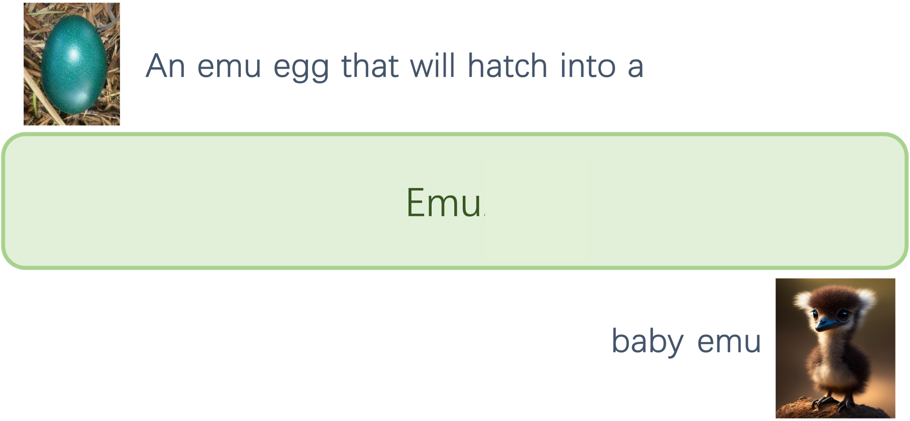

<h2>Emu: Generative Multimodal Models from BAAI</h2>

---

- [**Emu1**](Emu1) (arxiv 2023/07) - Generative Pretraining in Multimodality

- [**Emu2**](Emu2) (arxiv 2023/12) - Generative Multimodal Models are In-Context Learners

## News
- 2023.12 Inference code, model and demo of Emu2 are available. Enjoy the [demo](http://218.91.113.230:9002/).
- 2023.12 We have released Emu2, open and largest generative multimodal models that achieve new state of the art on multimodal understanding and generation tasks.
- 2023.7 Inference code and model of Emu are available.
- 2023.7 We have released Emu, a multimodal generalist that can seamlessly generate images and texts in multimodal context.

## Hightlights
- State-of-the-art performance
- Next-generation capabilities
- A base model for diverse tasks

We hope to foster the growth of our community through open-sourcing and promoting collaboration👬. Let's step towards multimodal intelligence together🍻.

## Contact
- **We are hiring** at all levels at BAAI Vision Team, including full-time researchers, engineers and interns. 
If you are interested in working with us on **foundation model, visual perception and multimodal learning**, please contact [Xinlong Wang](https://www.xloong.wang/) (`wangxinlong@baai.ac.cn`).

## Misc

