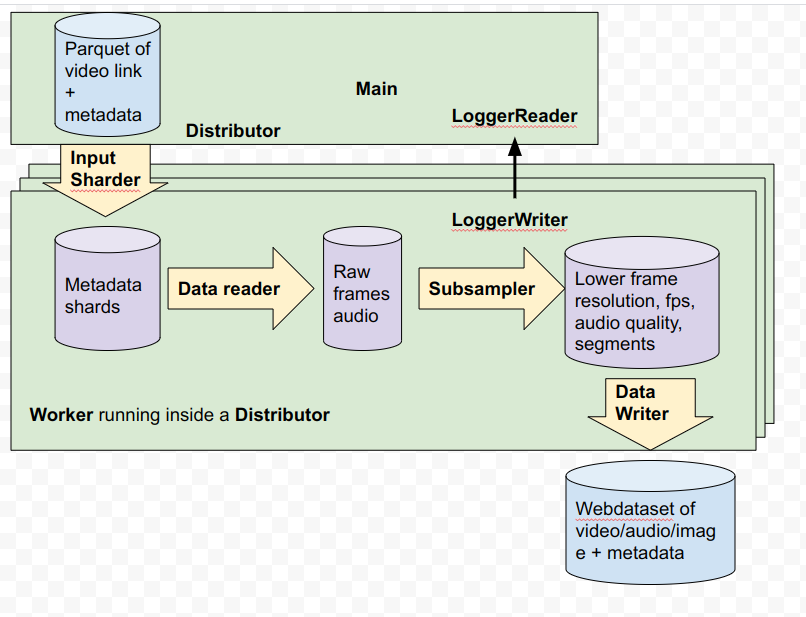

# video2dataset
[](https://pypi.python.org/pypi/video2dataset)

Easily create large video dataset from video urls

]

Checkout the [design doc](https://docs.google.com/document/d/1_TD2KQLkEegszq4Eip568fc6cWnh9h0Jqj4Lc88t9Y0/edit#)

## Install

pip install video2dataset

## Examples


## Usage

First get some video url list. For example:
```
echo 'https://www.youtube.com/watch?v=0WfKzVqdQqo' >> myvidlist.txt
```

Then, run the tool:

```
video2dataset --url_list=myvidlist.txt --output_folder=output_folder
```

The tool will then automatically download the urls and store them with that format:
* output_folder
    * 00000
        * 000000000.mp4
        * 000000001.mp4
        * 000000002.mp4

or as this format if choosing webdataset:
* output_folder
    * 00000.tar containing:
        * 000000000.mp4
        * 000000001.mp4
        * 000000002.mp4

with each number being the position in the list. The subfolders avoids having too many files in a single folder.

If **captions** are provided, they will be saved as 0.txt, 1.txt, ...

This can then easily be fed into machine learning training or any other use case.

Also .json files named 0.json, 1.json,... are saved with these keys:
* url
* caption
* key of the form 000010005 : the first 5 digits are the shard id, the last 4 are the index in the shard
* status : whether the download succeeded
* error_message

Also a .parquet file will be saved with the same name as the subfolder/tar files containing these same metadata.
It can be used to analyze the results efficiently.

.json files will also be saved with the same name suffixed by _stats, they contain stats collected during downloading (download time, number of success, ...)


## API

This module exposes a single function `download` which takes the same arguments as the command line tool:

* **url_list** A file with the list of url of images to download. It can be a folder of such files. (*required*)
* **output_folder** The path to the output folder. (default *"images"*)
* **processes_count** The number of processes used for downloading the pictures. This is important to be high for performance. (default *1*)
* **encode_formats** Dict of (modality, format) pairs specifying what file format each modality should be saved as. This determines which modalities will be written in the output dataset f.e. if we only specify audio only audio wil be saved (default *{"video": "mp4"}*)
* **output_format** decides how to save pictures (default *files*)
  * **files** saves as a set of subfolder containing pictures
  * **webdataset** saves as tars containing pictures
  * **parquet** saves as parquet containing pictures as bytes
  * **tfrecord** saves as tfrecord containing pictures as bytes
  * **dummy** does not save. Useful for benchmarks
* **input_format** decides how to load the urls (default *txt*)
  * **txt** loads the urls as a text file of url, one per line
  * **csv** loads the urls and optional caption as a csv
  * **tsv** loads the urls and optional caption as a tsv
  * **tsv.gz** loads the urls and optional caption as a compressed (gzip) tsv.gz
  * **json** loads the urls and optional caption as a json
  * **parquet** loads the urls and optional caption as a parquet
* **url_col** the name of the url column for parquet and csv (default *url*)
* **caption_col** the name of the caption column for parquet and csv (default *None*)
* **clip_col** the name of the column with a list of timespans for each clip (defualt *None*)
* **save_additional_columns** list of additional columns to take from the csv/parquet files and save in metadata files (default *None*)
* **number_sample_per_shard** the number of sample that will be downloaded in one shard (default *10000*)
* **timeout** maximum time (in seconds) to wait when trying to download an image (default *10*)
* **video_size** size of video frames (default *360*)
* **resize_mode** what resizing transformations to apply to video resolution (default *None*)
  * **scale** scale video keeping aspect ratios (currently always picks video height)
  * **crop** center crop to video_size x video_size
  * **pad** center pad to video_size x video_size
* **video_fps** what FPS to resample the video to. If < 0 then video FPS remains unchanged (default *-1*)
* **audio_rate** audio sampling rate, by default (-1) it is left unchanged from the downloaded video (default *-1*)
* **enable_wandb** whether to enable wandb logging (default *False*)
* **wandb_project** name of W&B project used (default *video2dataset*)
* **oom_shard_count** the order of magnitude of the number of shards, used only to decide what zero padding to use to name the shard files (default *5*)
* **distributor** choose how to distribute the downloading (default *multiprocessing*)
  * **multiprocessing** use a multiprocessing pool to spawn processes
  * **pyspark** use a pyspark session to create workers on a spark cluster (see details below)
* **subjob_size** the number of shards to download in each subjob supporting it, a subjob can be a pyspark job for example (default *1000*)
* **incremental_mode** Can be "incremental" or "overwrite". For "incremental", video2dataset will download all the shards that were not downloaded, for "overwrite" video2dataset will delete recursively the output folder then start from zero (default *incremental*)
* **tmp_dir** name of temporary directory in your file system (default */tmp*)
* **yt_metadata_args** dict of YouTube metadata arguments (default *None*, more info below)
* **detect_cuts** whether or not to detect jump-cuts in each video and store as metadata (default *False*)
* **cut_detection_mode** Can be either "longest" or "all" -- "longest" will select the longest contiguous (i.e. no jump-cuts) section of video, and "all" will select all contiguous sections of video to store in metadata (default *"longest"*)
* **cut_framerates** a list of additional framerates to detect jump cuts at. If None, jump cuts will only be detected at the original framerate of the video (default *None*)
* **cuts_are_clips** whether or not to turn each contiguous section of each input video into a distinct ouput video (default *False*)
* **stage** which stage of processing to execute in betweeen downloading + cheap subsampling and costly subsampling (default *"download"*)

## Downloading YouTube Metadata

If we want to download a large amount of YouTube videos with video2dataset we can specify some parameters and also extract useful metadata as well. For directions on how to do so please see this [example](https://github.com/iejMac/video2dataset/blob/main/examples/yt_metadata.md).

## Incremental mode

If a first download got interrupted for any reason, you can run again with --incremental "incremental" (this is the default) and using the same output folder , the same number_sample_per_shard and the same input urls, and video2dataset will complete the download.

## Output format choice

video2dataset support several formats. There are trade off for which to choose:
* files: this is the simplest one, images are simply saved as files. It's good for up to 1M samples on a local file system. Beyond that performance issues appear very fast. Handling more than a million files in standard filesystem does not work well.
* webdataset: webdataset format saves samples in tar files, thanks to [webdataset](https://webdataset.github.io/webdataset/) library, this makes it possible to load the resulting dataset fast in both pytorch, tensorflow and jax. Choose this for most use cases. It works well for any filesystem
* parquet: parquet is a columnar format that allows fast filtering. It's particularly easy to read it using pyarrow and pyspark. Choose this if the rest of your data ecosystem is based on pyspark. [petastorm](https://github.com/uber/petastorm) can be used to read the data but it's not as easy to use as webdataset
* tfrecord: tfrecord is a protobuf based format. It's particularly easy to use from tensorflow and using [tf data](https://www.tensorflow.org/guide/data). Use this if you plan to use the dataset only in the tensorflow ecosystem. The tensorflow writer does not use fsspec and as a consequence supports only a limited amount of filesystem, including local, hdfs, s3 and gcs. It is also less efficient than the webdataset writer when writing to other filesystems than local, losing some 30% performance.

## File system support

Thanks to [fsspec](https://filesystem-spec.readthedocs.io/en/latest/), video2dataset supports reading and writing files in [many file systems](https://github.com/fsspec/filesystem_spec/blob/6233f315548b512ec379323f762b70764efeb92c/fsspec/registry.py#L87).
To use it, simply use the prefix of your filesystem before the path. For example `hdfs://`, `s3://`, `http://`, or `gcs://`.
Some of these file systems require installing an additional package (for example s3fs for s3, gcsfs for gcs).
See fsspec doc for all the details.

If you need specific configuration for your filesystem, you may handle this problem by using the [fsspec configuration system](https://filesystem-spec.readthedocs.io/en/latest/features.html#configuration) that makes it possible to create a file such as `.config/fsspec/s3.json` and have information in it such as:
```
{
  "s3": {
    "client_kwargs": {
            "endpoint_url": "https://some_endpoint",
            "aws_access_key_id": "your_user",
           "aws_secret_access_key": "your_password"
    }
  }
}
```
Which may be necessary if using s3 compatible file systems such as [minio](https://min.io/). That kind of configuration also work for all other fsspec-supported file systems.

## Distribution modes

video2dataset supports several distributors.
* multiprocessing which spawns a process pool and use these local processes for downloading
* pyspark which spawns workers in a spark pool to do the downloading

multiprocessing is a good option for downloading on one machine, and as such it is the default.
Pyspark lets video2dataset use many nodes, which makes it as fast as the number of machines.
It can be particularly useful if downloading datasets with more than a billion image. Here's an [example](https://github.com/iejMac/video2dataset/blob/main/examples/distributed_spark.md)
for how we used pyspark distributed mode to download 40M videos with metadata.

### pyspark configuration

In order to use video2dataset with pyspark, you will need to do this:
1. `pip install pyspark`
2. use the `--distributor pyspark` option
3. tweak the `--subjob_size 1000` option: this is the number of images to download in each subjob. Increasing it will mean a longer time of preparation to put the feather files in the temporary dir, a shorter time will mean sending less shards at a time to the pyspark job.

By default a local spark session will be created.
You may want to create a custom spark session depending on your specific spark cluster.


## For development

Either locally, or in [gitpod](https://gitpod.io/#https://github.com/iejMac/video2dataset) (do `export PIP_USER=false` there)

Setup a virtualenv:

```
python3 -m venv .env
source .env/bin/activate
pip install -e .
```

to run tests:
```
pip install -r requirements-test.txt
```
then 
```
make lint
make test
```

You can use `make black` to reformat the code

`python -m pytest -x -s -v tests -k "dummy"` to run a specific test

## Benchmarks

## Special Contributors:

* [ChatGPT](https://chat.openai.com) - FrameSubsampler implementation

## Citation
```
@misc{beaumont-2023-video2dataset,
  author = {Romain Beaumont, Maciej Kilian},
  title = {video2dataset: Easily turn large sets of video urls to a video dataset},
  year = {2023},
  publisher = {GitHub},
  journal = {GitHub repository},
  howpublished = {\url{https://github.com/iejMac/video2dataset}}
}
```
